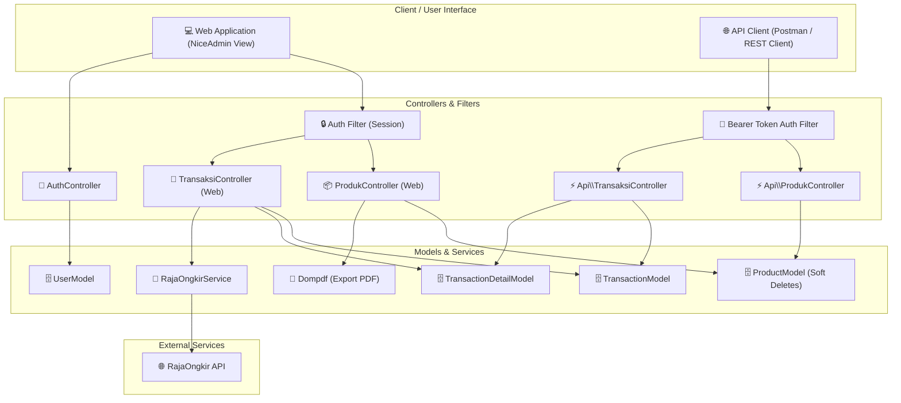

# 🛍️ Toko Online - CodeIgniter 4 Enterprise Starter

[](https://www.php.net/)
[](https://codeigniter.com/)
[](LICENSE)
[](https://www.mysql.com/)

Proyek ini adalah platform toko online dinamis yang dibangun di atas kerangka kerja **CodeIgniter 4** menggunakan template **NiceAdmin**. Sistem ini dirancang untuk menangani alur e-commerce lengkap, mulai dari katalog produk interaktif, sistem keranjang belanja dengan API Ongkir pihak ketiga, checkout transaksi, panel administrasi (CRUD & ekspor laporan PDF), hingga integrasi RESTful API yang aman dengan otentikasi Bearer Token.

---

## 🗺️ Arsitektur & Alur Kerja Sistem

Bagan di bawah ini menggambarkan arsitektur MVC (Model-View-Controller) aplikasi, aliran middleware keamanan (Filters), dan integrasinya dengan layanan eksternal:



---

## ✨ Fitur Utama

### 🛍️ Katalog & Manajemen Produk
- **Katalog Produk Dinamis**: Pencarian produk berbasis teks dan visualisasi gambar.
- **Panel Admin CRUD**: Pengelolaan stok, harga, nama produk, dan pengunggahan berkas gambar produk.
- **Ekspor Dokumen PDF**: Mengunduh daftar produk aktif ke format dokumen PDF menggunakan pustaka **Dompdf**.
- **Soft Deletes**: Produk yang dihapus tidak langsung hilang dari database, melainkan ditandai pada kolom `deleted_at` untuk keamanan data transaksi lama.

### 🛒 Keranjang Belanja & Logistik
- **Keranjang Interaktif**: Tambah produk, ubah jumlah secara real-time, hapus item, dan bersihkan keranjang secara instan berbasis *CodeIgniter Cart Module*.
- **Integrasi Ongkos Kirim**: Perhitungan estimasi biaya pengiriman menggunakan **RajaOngkir Domestic API** berdasarkan berat produk, kota asal, kota tujuan, dan kurir (JNE, POS, dsb).

### 💳 Checkout & Riwayat Transaksi
- **Transaksi Aman**: Pengurangan otomatis stok produk yang dibeli setelah proses checkout berhasil.
- **Riwayat Belanja**: Pengguna dapat melihat daftar transaksi belanja masa lalu beserta detail produk yang dibeli.

### ⚡ RESTful API Terproteksi
- Menghadirkan API terpisah di namespace `App\Controllers\Api` untuk integrasi mobile atau sistem eksternal.
- Proteksi menggunakan **Bearer Token Authentication** (`MY_API_KEY`) yang divalidasi langsung melalui filter otentikasi kustom.

---

## 📂 Struktur Direktori Proyek

```text
belajar-ci/
├── app/
│   ├── Config/              # Konfigurasi sistem (Routes, Filters, Database, dll)
│   ├── Controllers/         # Controller aplikasi (MVC)
│   │   ├── Api/             # RESTful API Controllers (Produk, Transaksi)
│   │   ├── AuthController.php
│   │   ├── ProdukController.php
│   │   └── TransaksiController.php
│   ├── Database/
│   │   ├── Migrations/      # Skema database (User, Product, Transaction, dll)
│   │   └── Seeds/           # Seeder database untuk inisialisasi data dummy
│   ├── Filters/             # Middleware otentikasi (Session & Bearer Token)
│   ├── Models/              # Representasi tabel database & logic data
│   ├── Services/            # Layanan integrasi API pihak ketiga (RajaOngkir)
│   └── Views/               # Template tampilan front-end (NiceAdmin)
├── public/
│   ├── uploads/             # Direktori penyimpanan unggahan gambar produk
│   └── NiceAdmin/           # Aset statis CSS, JS, & HTML dari template admin
├── tests/
│   └── api/                 # Pengujian API (*.rest)
├── .env.example             # Contoh template konfigurasi environment
└── composer.json            # Dependensi pustaka PHP (CI4, Dompdf, Cart)
```

---

## 💻 Persyaratan Sistem

- **PHP** versi `^8.2` (ekstensi `intl`, `mbstring`, `curl`, dan `gd` harus aktif)
- **Composer** (manajer dependensi PHP)
- **MySQL / MariaDB** (melalui XAMPP, Laragon, atau MySQL Standalone)
- **Web Server** lokal (PHP Built-in Server / Apache)

---

## 🚀 Panduan Instalasi & Konfigurasi

Ikuti langkah-langkah di bawah ini untuk menjalankan proyek ini di komputer lokal Anda:

### 1. Kloning Repositori
```bash
git clone [URL-repository-Anda]
cd belajar-ci
```

### 2. Pasang Dependensi
Jalankan Composer untuk mengunduh CodeIgniter 4 framework, Dompdf, dan Modul Keranjang Belanja:
```bash
composer install
```

### 3. Konfigurasi Environment (`.env`)
Salin berkas `.env.example` menjadi `.env`:
```bash
cp .env.example .env
```
Buka berkas `.env` dan sesuaikan kredensial database serta API key Anda:
```ini
CI_ENVIRONMENT = development

database.default.hostname = localhost
database.default.database = db_ci4
database.default.username = root
database.default.password = 
database.default.port = 3306

# API Key untuk RajaOngkir & Integrasi REST API
RAJAONGKIR_API_KEY = your_rajaongkir_key_here
MY_API_KEY = my-secret-token
```

> [!IMPORTANT]
> Pastikan Apache dan MySQL pada server lokal Anda (seperti XAMPP) dalam keadaan aktif sebelum melanjutkan ke langkah berikutnya.

### 4. Setup Database & Seeding
Jalankan perintah Spark untuk membuat seluruh tabel yang dibutuhkan secara otomatis melalui berkas migrasi:
```bash
php spark migrate
```
Setelah tabel terbentuk, isi tabel dengan data awal (*dummy*) menggunakan seeder berikut:
```bash
php spark db:seed UserSeeder
php spark db:seed ProductSeeder
```

### 5. Menjalankan Server Lokal
Jalankan aplikasi menggunakan built-in web server CodeIgniter:
```bash
php spark serve
```
Aplikasi kini berjalan dan dapat diakses melalui browser di alamat [http://localhost:8080](http://localhost:8080).

---

## ⚡ Dokumentasi & Pengujian REST API

Proyek ini dilengkapi berkas pengujian [product.rest](file:///D:/GitHub/belajar-ci/tests/api/product.rest) yang bisa dijalankan langsung di VS Code menggunakan ekstensi **REST Client**. 

Semua request API memerlukan header otentikasi berikut:
```http
Authorization: Bearer <MY_API_KEY_dari_env>
Accept: application/json
```

<details>
<summary><b>📦 API Produk (Endpoints & Contoh Request)</b></summary>

#### 1. Mendapatkan Semua Produk (Paginated)
* **Method**: `GET`
* **URL**: `/api/products`
* **Query Params**: `page` (default `1`), `per_page` (default `10`)
* **Response**:
  ```json
  {
    "data": [
      {
        "id": 1,
        "nama": "Yoga Slim 7i Aura Edition",
        "harga": 15000000,
        "jumlah": 10,
        "foto": "yoga.jpg",
        "created_at": "2026-06-23 03:59:27",
        "updated_at": "2026-06-23 03:59:27",
        "deleted_at": null
      }
    ],
    "pagination": {
      "current_page": 1,
      "per_page": 1,
      "last_page": 5,
      "total_data": 5,
      "has_next": true,
      "has_prev": false
    }
  }
  ```

#### 2. Mendapatkan Detail Produk
* **Method**: `GET`
* **URL**: `/api/products/{id}`

#### 3. Membuat Produk Baru
* **Method**: `POST`
* **URL**: `/api/products`
* **Body (JSON)**:
  ```json
  {
    "nama": "Yoga Slim 7i Aura Edition",
    "harga": 15000000,
    "jumlah": 10
  }
  ```

#### 4. Memperbarui Produk (Semua Kolom)
* **Method**: `PUT`
* **URL**: `/api/products/{id}`
* **Body (JSON)**:
  ```json
  {
    "nama": "Yoga Slim 7i Aura Edition Updated",
    "harga": 16000000,
    "jumlah": 8
  }
  ```

#### 5. Memperbarui Produk sebagian (*Partial Update*)
* **Method**: `PATCH`
* **URL**: `/api/products/{id}`
* **Body (JSON)**:
  ```json
  {
    "jumlah": 25
  }
  ```

#### 6. Menghapus Produk (Soft Delete)
* **Method**: `DELETE`
* **URL**: `/api/products/{id}`

> [!WARNING]
> Menghapus produk melalui method `DELETE` akan mengaktifkan *Soft Delete*. Produk tidak terhapus dari baris fisik database melainkan diperbarui kolom `deleted_at`-nya. Melakukan kueri `DELETE` atau `GET` biasa setelah produk terhapus akan mengembalikan error `404 Not Found` kecuali kueri database Anda menggunakan pemanggil `withDeleted()`.

</details>

<details>
<summary><b>💸 API Transaksi (Endpoints & Contoh Request)</b></summary>

#### 1. Riwayat Transaksi (Dengan Detail & Produk)
* **Method**: `GET`
* **URL**: `/api/transactions`
* **Query Params**:
  - `start` (Format: `YYYY-MM-DD`, Opsional)
  - `end` (Format: `YYYY-MM-DD`, Opsional)
  - `page` (Default `1`)
  - `per_page` (Default `10`)
* **Response**:
  ```json
  {
    "filter": {
      "start": "2026-06-01",
      "end": "2026-06-30"
    },
    "data": [
      {
        "id": 1,
        "user_id": 2,
        "total_harga": 15000000,
        "alamat_tujuan": "Kota Bekasi",
        "created_at": "2026-06-23 04:02:15",
        "updated_at": "2026-06-23 04:02:15",
        "deleted_at": null,
        "details": [
          {
            "id": 1,
            "transaction_id": 1,
            "product_id": 5,
            "jumlah": 1,
            "diskon": null,
            "subtotal_harga": 15000000,
            "nama_produk": "Yoga Slim 7i Aura Editions"
          }
        ]
      }
    ],
    "pagination": {
      "current_page": 1,
      "per_page": 10,
      "last_page": 1,
      "total_data": 1,
      "has_next": false,
      "has_prev": false
    }
  }
  ```

</details>

---

## 📄 Lisensi

Proyek ini dilisensikan di bawah **[Lisensi MIT](LICENSE)**. Anda bebas menyalin, memodifikasi, dan mendistribusikan kode ini untuk kebutuhan pribadi maupun komersial.
